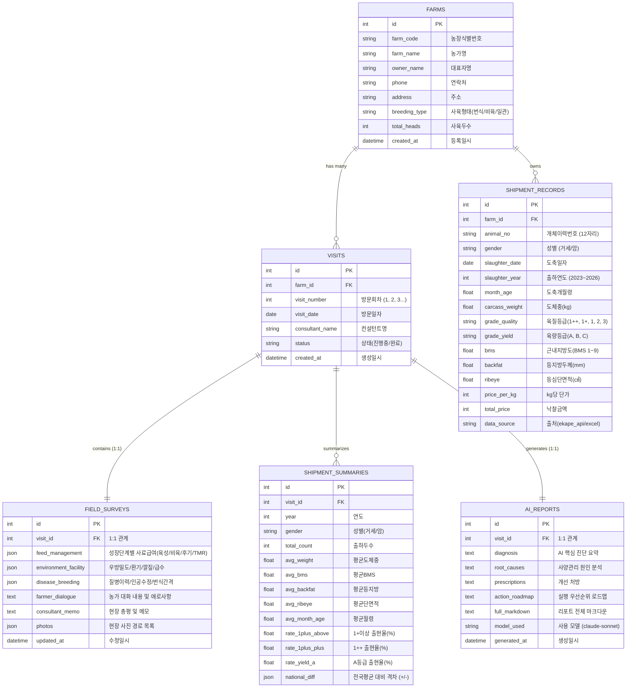

# [설계서 02] 데이터베이스 및 누적 DB 설계서

## 1. 개요
본 시스템은 방문한 모든 농가의 **출하성적, 전국비교분석표, 현장수집정보, AI분석리포트**를 영구적으로 저장 누적하여,
시간이 지남에 따라 컨설팅 히스토리가 자산화되고 언제든지 전체 방문 농가의 평균 성적과 비교할 수 있도록 설계합니다.
구글 드라이브 환경에서 백업과 동기화가 용이하도록 **SQLite 3 단일 파일 DB(`consulting.db`)**를 기본 채택합니다.

---

## 2. ERD (Entity Relationship Diagram)



---

## 3. SQL 테이블 DDL 스크립트

```sql
-- 1. 농가 마스터 테이블
CREATE TABLE IF NOT EXISTS farms (
    id INTEGER PRIMARY KEY AUTOINCREMENT,
    farm_code TEXT UNIQUE,
    farm_name TEXT NOT NULL,
    owner_name TEXT,
    phone TEXT,
    address TEXT,
    breeding_type TEXT DEFAULT '비육우',
    total_heads INTEGER DEFAULT 0,
    created_at DATETIME DEFAULT CURRENT_TIMESTAMP
);

-- 2. 방문 회차 테이블
CREATE TABLE IF NOT EXISTS visits (
    id INTEGER PRIMARY KEY AUTOINCREMENT,
    farm_id INTEGER NOT NULL REFERENCES farms(id) ON DELETE CASCADE,
    visit_number INTEGER NOT NULL DEFAULT 1,
    visit_date DATE NOT NULL,
    consultant_name TEXT,
    status TEXT DEFAULT 'completed',
    created_at DATETIME DEFAULT CURRENT_TIMESTAMP,
    UNIQUE(farm_id, visit_number)
);

-- 3. 현장 방문 조사 테이블 (모바일 입력 폼 1:1 매칭)
CREATE TABLE IF NOT EXISTS field_surveys (
    id INTEGER PRIMARY KEY AUTOINCREMENT,
    visit_id INTEGER UNIQUE NOT NULL REFERENCES visits(id) ON DELETE CASCADE,
    feed_data TEXT,         -- JSON: 단계별 사료/조사료 급여 실태
    facility_data TEXT,     -- JSON: 우방밀도, 환기팬, 깔짚상태
    health_data TEXT,       -- JSON: 질병 발생, 대사성 질환, 번식
    farmer_dialogue TEXT,   -- 농장주 대화/고민/목표 (자유 텍스트)
    consultant_memo TEXT,   -- 컨설턴트 관찰 종합 소견
    photos TEXT,            -- JSON: 이미지 경로 배열
    updated_at DATETIME DEFAULT CURRENT_TIMESTAMP
);

-- 4. 개체별 출하성적 테이블 (이력제 API 및 엑셀 파싱 원본)
CREATE TABLE IF NOT EXISTS shipment_records (
    id INTEGER PRIMARY KEY AUTOINCREMENT,
    farm_id INTEGER NOT NULL REFERENCES farms(id) ON DELETE CASCADE,
    animal_no TEXT NOT NULL,
    gender TEXT NOT NULL,
    slaughter_date DATE,
    slaughter_year INTEGER,
    month_age REAL,
    carcass_weight REAL,
    grade_quality TEXT,
    grade_yield TEXT,
    bms REAL,
    backfat REAL,
    ribeye REAL,
    price_per_kg INTEGER,
    total_price INTEGER,
    data_source TEXT DEFAULT 'api',
    created_at DATETIME DEFAULT CURRENT_TIMESTAMP,
    UNIQUE(farm_id, animal_no)
);

-- 5. 출하성적 연도별 요약 및 전국 비교 집계 테이블
CREATE TABLE IF NOT EXISTS shipment_summaries (
    id INTEGER PRIMARY KEY AUTOINCREMENT,
    visit_id INTEGER NOT NULL REFERENCES visits(id) ON DELETE CASCADE,
    year INTEGER NOT NULL,
    gender TEXT NOT NULL,
    total_count INTEGER NOT NULL,
    avg_weight REAL,
    avg_bms REAL,
    avg_backfat REAL,
    avg_ribeye REAL,
    avg_month_age REAL,
    rate_1plus_above REAL,
    rate_1plus_plus REAL,
    rate_yield_a REAL,
    national_diff TEXT, -- JSON: 전국대비 격차
    created_at DATETIME DEFAULT CURRENT_TIMESTAMP
);

-- 6. Claude AI 분석 리포트 테이블
CREATE TABLE IF NOT EXISTS ai_reports (
    id INTEGER PRIMARY KEY AUTOINCREMENT,
    visit_id INTEGER UNIQUE NOT NULL REFERENCES visits(id) ON DELETE CASCADE,
    diagnosis TEXT,
    root_causes TEXT,
    prescriptions TEXT,
    action_roadmap TEXT,
    full_markdown TEXT NOT NULL,
    model_used TEXT DEFAULT 'claude-sonnet-4-5-20250929',
    generated_at DATETIME DEFAULT CURRENT_TIMESTAMP
);
```

---

## 4. 누적 통계 집계 쿼리 설계

### 4.1 지금까지 방문한 전체 농가의 연도별 평균 성적 산출
```sql
SELECT 
    sr.slaughter_year AS year,
    sr.gender,
    COUNT(DISTINCT sr.farm_id) AS total_farms_count,
    COUNT(sr.id) AS total_heads_count,
    ROUND(AVG(sr.carcass_weight), 1) AS avg_carcass_weight,
    ROUND(AVG(sr.bms), 1) AS avg_bms,
    ROUND(AVG(sr.backfat), 1) AS avg_backfat,
    ROUND(AVG(sr.ribeye), 1) AS avg_ribeye,
    ROUND(AVG(sr.month_age), 1) AS avg_month_age,
    ROUND(SUM(CASE WHEN sr.grade_quality IN ('1++', '1+') THEN 1 ELSE 0 END) * 100.0 / COUNT(sr.id), 1) AS rate_1plus_above,
    ROUND(SUM(CASE WHEN sr.grade_quality = '1++' THEN 1 ELSE 0 END) * 100.0 / COUNT(sr.id), 1) AS rate_1plus_plus
FROM shipment_records sr
WHERE sr.gender IN ('거세', '암')
  AND sr.slaughter_year BETWEEN 2023 AND 2026
GROUP BY sr.slaughter_year, sr.gender
ORDER BY sr.slaughter_year DESC, sr.gender;
```

이 쿼리를 통해 대시보드에서 **"전국 평균" vs "우리 시스템에 누적된 전체 방문농가 평균" vs "특정 농가 성적"**을 실시간 비교 차트로 표출합니다.
